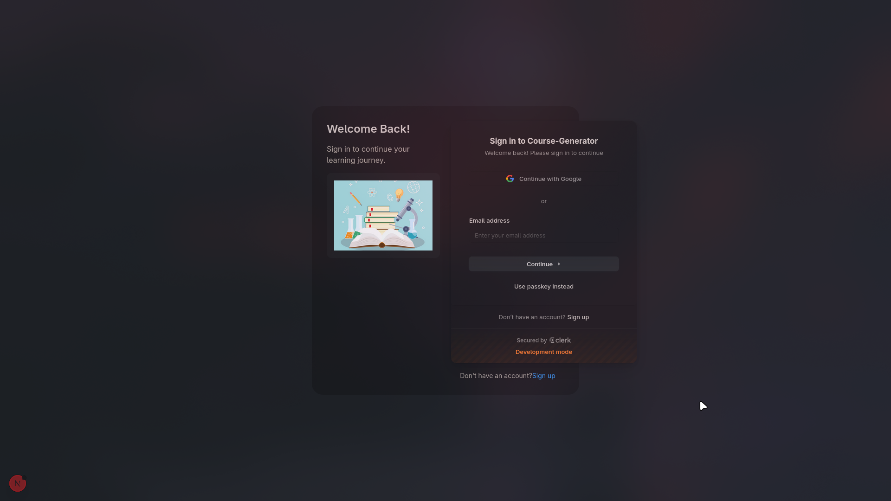
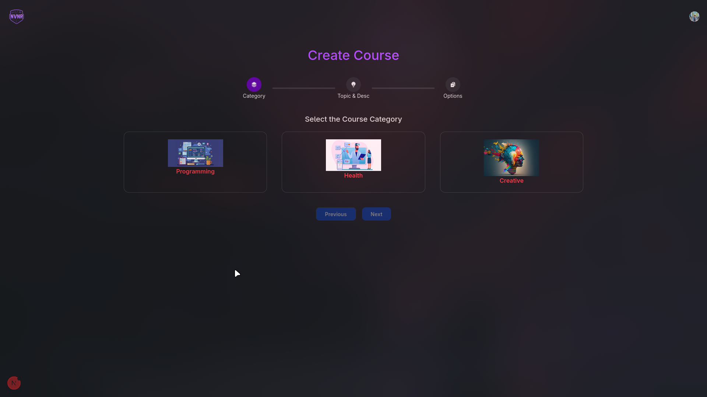
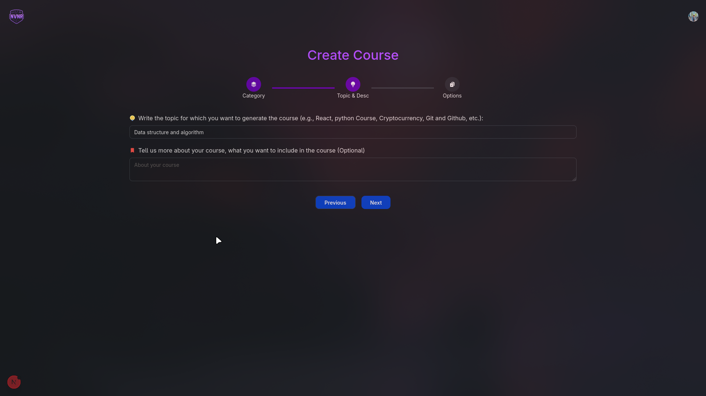
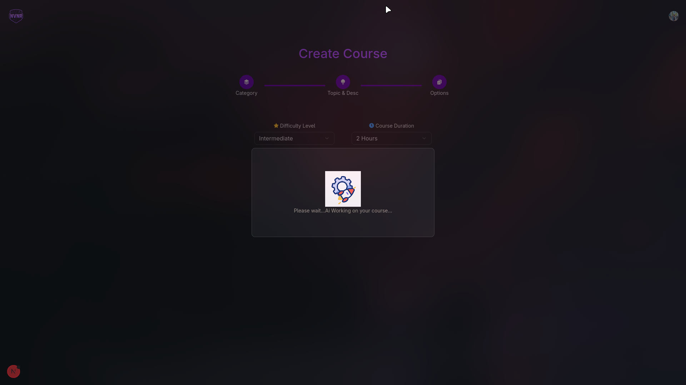
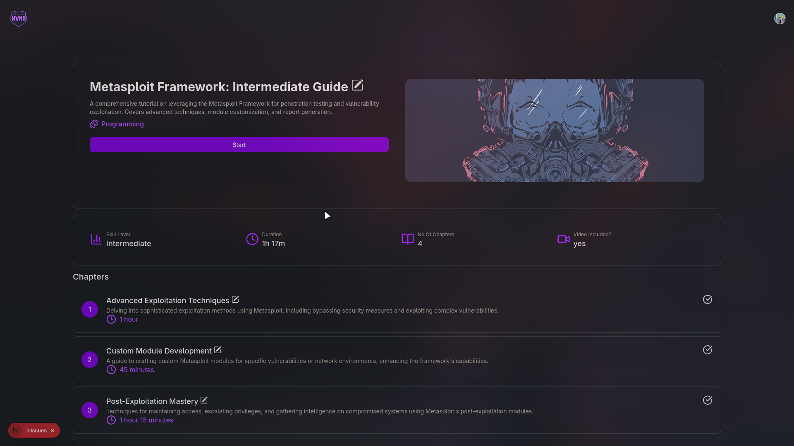
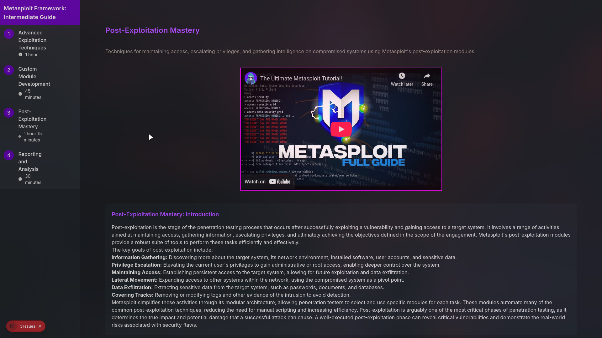
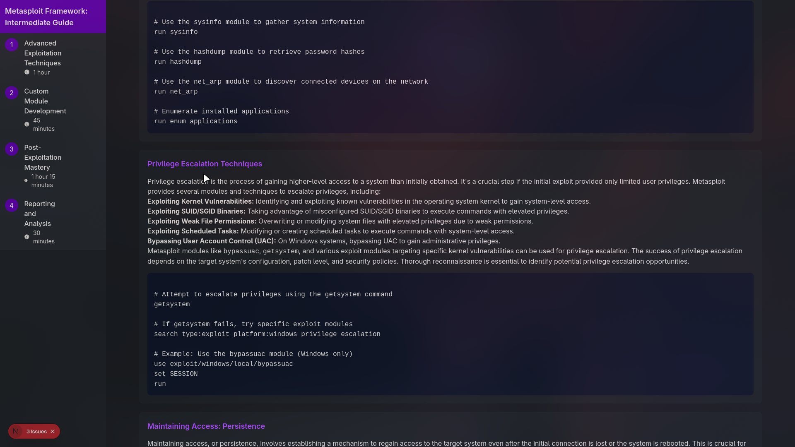
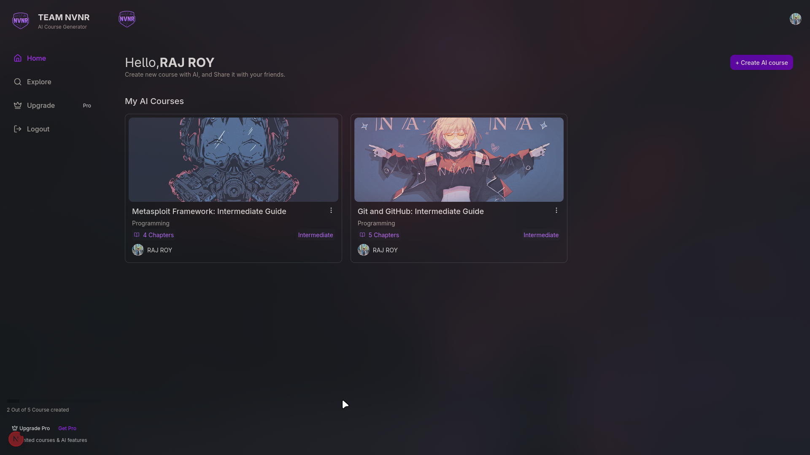

# AI-Powered Course Generator

[](https://opensource.org/licenses/MIT)

An innovative platform that leverages AI to generate comprehensive courses on any topic. Users can create, customize, and learn educational content effortlessly.

## About The Project

This project is a web application designed to automate the process of course creation. It utilizes the power of Google's Gemini AI to generate course content, including titles, chapters, and descriptions, based on user input. The platform provides a seamless experience for educators, students, and lifelong learners to generate and access high-quality educational materials.

The application features a user-friendly interface for creating and managing courses, a secure authentication system, and a dynamic content generation engine. It is built with a modern tech stack, ensuring a robust and scalable solution.

### Built With

- **[Next.js](https://nextjs.org/)** - React framework for building server-side rendered and static web applications.
- **[React](https://reactjs.org/)** - A JavaScript library for building user interfaces.
- **[Tailwind CSS](https://tailwindcss.com/)** - A utility-first CSS framework for rapid UI development.
- **[Drizzle ORM](https://orm.drizzle.team/)** - A TypeScript ORM for SQL databases.
- **[PostgreSQL](https://www.postgresql.org/)** - A powerful, open-source object-relational database system.
- **[Neon](https://neon.tech/)** - A serverless PostgreSQL platform.
- **[Clerk](https://clerk.com/)** - User authentication and management.
- **[Google Gemini AI](https://ai.google.dev/)** - AI model for content generation.
- **[Razorpay](https://razorpay.com/)** - Payment gateway for processing transactions.

## Getting Started

To get a local copy up and running, follow these simple steps.

### Prerequisites

- **Node.js** (version 18.x or higher)
- **npm** or **yarn**
- **PostgreSQL** database

### Installation

1.  **Clone the repo**
    ````sh
    git clone https://github.com/RAJ8664/Intern.git    ```
    ````
2.  **Navigate to the project directory**
    ```sh
    cd course-generator
    ```
3.  **Install NPM packages**
    ```sh
    npm install
    ```
4.  **Set up environment variables**
    Create a `.env.local` file in the root of the `course-generator` directory and add the following environment variables:

    ```env
    NEXT_PUBLIC_CLERK_PUBLISHABLE_KEY=your_clerk_publishable_key
    CLERK_SECRET_KEY=your_clerk_secret_key
    NEXT_PUBLIC_CLERK_SIGN_IN_URL=/sign-in
    NEXT_PUBLIC_CLERK_SIGN_UP_URL=/sign-up
    NEXT_PUBLIC_CLERK_AFTER_SIGN_IN_URL=/dashboard
    NEXT_PUBLIC_CLERK_AFTER_SIGN_UP_URL=/dashboard

    DATABASE_URL=your_database_url

    NEXT_PUBLIC_CLOUDINARY_API_KEY=
    NEXT_PUBLIC_CLOUDINARY_API_SECRET=
    NEXT_PUBLIC_CLOUDINARY_API_URL=CLOUDINARY_URL=
    NEXT_PUBLIC_CLOUDINARY_CLOUD_NAME=

    NEXT_PUBLIC_YOUTUBE_API_KEY=

    GEMINI_API_KEY=your_gemini_api_key

    RAZORPAY_KEY_ID=your_razorpay_key_id
    RAZORPAY_KEY_SECRET=your_razorpay_key_secret

    ```

    ```

    ```

5.  **Push the database schema**
    ```sh
    npm run db:push
    ```
6.  **Run the development server**
    ```sh
    npm run dev
    ```
    Open [http://localhost:3000](http://localhost:3000) with your browser to see the result.

## Features

- **AI-Powered Course Generation:** Automatically create courses with titles, chapters, and descriptions using Google's Gemini AI.
- **User Authentication:** Secure sign-up and sign-in functionality with Clerk.
- **Course Management:** Create, read, update, and delete courses.
- **Interactive UI:** A modern and responsive user interface built with Next.js and Tailwind CSS.
- **Payment Integration:** Seamlessly handle payments with Razorpay.
- **Customizable Content:** Edit and refine the AI-generated content to meet your needs.

## Screenshots

|    |  |
| -------------------------------------- | ------------------------------------- |
|    |  |
|    |   |
|  |   |
|   |  |

## License

Distributed under the MIT License. See `LICENSE` for more information.

